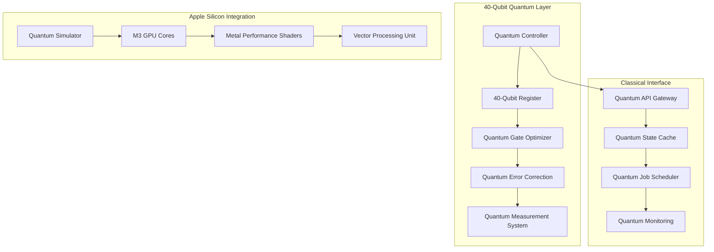
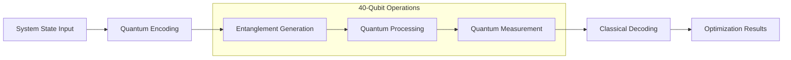

# 40-Qubit Implementation Strategy Design

## Overview

The 40-Qubit Implementation Strategy represents a quantum leap in computational capability for the PQS Framework. By doubling the qubit count from 20 to 40, we unlock exponential increases in quantum state space (2^40 vs 2^20 states) and enable sophisticated quantum algorithms that can model complex system interdependencies impossible with classical computing.

This design leverages quantum entanglement, superposition, and interference to create a quantum-enhanced energy management system that can simultaneously optimize multiple system processes while predicting future resource needs with unprecedented accuracy.

## Architecture

### Quantum Computing Layer Architecture



### Quantum Algorithm Pipeline



## Components and Interfaces

### 1. Quantum Circuit Manager

**Purpose**: Manages 40-qubit quantum circuits with dynamic allocation and optimization.

**Key Methods**:
- `create_40_qubit_circuit()`: Initialize 40-qubit quantum register
- `allocate_qubits(algorithm, required_qubits)`: Dynamic qubit allocation
- `optimize_gate_sequence(circuit)`: Gate optimization for 40-qubit topology
- `partition_circuit(circuit, max_qubits)`: Circuit partitioning for memory constraints

**Interfaces**:
- Input: Algorithm specifications, qubit requirements
- Output: Optimized quantum circuits, execution metadata

### 2. Quantum Entanglement Engine

**Purpose**: Creates and manages complex entanglement patterns for process correlation analysis.

**Key Methods**:
- `create_entangled_pairs(process_list)`: Generate entangled qubit pairs
- `measure_entanglement_strength(qubits)`: Quantify entanglement levels
- `preserve_entanglement(circuit)`: Implement decoherence protection
- `analyze_correlations(entangled_state)`: Extract process relationships

**Interfaces**:
- Input: Process correlation matrices, system state vectors
- Output: Entangled quantum states, correlation insights

### 3. Apple Silicon Quantum Accelerator

**Purpose**: Leverages M3 GPU cores for quantum simulation acceleration.

**Key Methods**:
- `initialize_metal_quantum_backend()`: Setup Metal compute shaders
- `execute_quantum_simulation(circuit)`: GPU-accelerated quantum simulation
- `optimize_memory_usage(state_vector)`: Quantum state compression
- `thermal_aware_scheduling(workload)`: Dynamic performance scaling

**Interfaces**:
- Input: Quantum circuits, simulation parameters
- Output: Quantum measurement results, performance metrics

### 4. Quantum Machine Learning Interface

**Purpose**: Integrates 40-qubit quantum neural networks with classical ML models.

**Key Methods**:
- `encode_features_quantum(data, qubits=40)`: Quantum feature encoding
- `train_quantum_neural_network(training_data)`: QNN training
- `quantum_prediction(input_state)`: Quantum-enhanced predictions
- `hybrid_classical_quantum_inference(data)`: Combined ML approach

**Interfaces**:
- Input: Training datasets, feature vectors
- Output: Trained quantum models, prediction results

## Data Models

### Quantum State Representation

```python
@dataclass
class QuantumState40:
    qubits: int = 40
    state_vector: np.ndarray  # 2^40 complex amplitudes
    entanglement_map: Dict[Tuple[int, int], float]
    measurement_history: List[Dict[str, Any]]
    fidelity: float
    coherence_time: float
    
@dataclass
class QuantumCircuit40:
    register: QuantumRegister
    classical_register: ClassicalRegister
    gates: List[QuantumGate]
    depth: int
    width: int = 40
    optimization_level: int
    error_correction: bool
```

### Process Quantum Encoding

```python
@dataclass
class ProcessQuantumEncoding:
    process_id: int
    qubit_allocation: List[int]  # Which qubits represent this process
    encoding_type: str  # 'amplitude', 'basis', 'angle'
    entangled_processes: List[int]
    quantum_features: Dict[str, float]
    measurement_basis: str
```

### Quantum Algorithm Configuration

```python
@dataclass
class QuantumAlgorithmConfig:
    algorithm_name: str
    required_qubits: int
    max_circuit_depth: int
    error_threshold: float
    optimization_target: str  # 'speed', 'accuracy', 'energy'
    apple_silicon_acceleration: bool
    fallback_classical: bool
```

## Error Handling

### Quantum Error Correction

1. **Decoherence Protection**
   - Implement quantum error correction codes for 40-qubit systems
   - Monitor coherence times and adjust circuit execution accordingly
   - Automatic retry with error mitigation for failed quantum operations

2. **Hardware Fallback Strategy**
   - Primary: 40-qubit quantum hardware (if available)
   - Secondary: High-fidelity quantum simulation on M3 GPU
   - Tertiary: Classical approximation algorithms

3. **Circuit Optimization Failures**
   - Automatic circuit partitioning when optimization fails
   - Dynamic qubit reallocation for resource constraints
   - Graceful degradation to smaller qubit counts

### Apple Silicon Integration Errors

1. **Memory Overflow Handling**
   - Quantum state vector compression algorithms
   - Intelligent circuit partitioning strategies
   - Dynamic memory management with Metal buffers

2. **Thermal Management**
   - Real-time thermal monitoring integration
   - Automatic workload reduction during thermal events
   - Intelligent scheduling to prevent thermal throttling

## Testing Strategy

### Quantum Algorithm Validation

1. **Quantum Supremacy Verification**
   - Benchmark 40-qubit algorithms against classical equivalents
   - Measure quantum advantage in energy optimization tasks
   - Validate entanglement-based correlation detection

2. **Fidelity Testing**
   - Quantum state tomography for circuit validation
   - Process fidelity measurements for algorithm accuracy
   - Noise characterization and mitigation validation

3. **Performance Benchmarking**
   - M3 GPU acceleration performance metrics
   - Memory usage optimization validation
   - Real-time execution latency measurements

### Integration Testing

1. **PQS Framework Compatibility**
   - Seamless integration with existing 20-qubit infrastructure
   - Backward compatibility for existing quantum algorithms
   - Menu bar app integration with 40-qubit status display

2. **Apple Silicon Optimization**
   - Metal compute shader performance validation
   - Memory bandwidth utilization testing
   - Thermal behavior under sustained quantum workloads

### Stress Testing

1. **Quantum Circuit Complexity**
   - Maximum circuit depth and width testing
   - Entanglement scaling behavior analysis
   - Error rate characterization under heavy loads

2. **System Resource Management**
   - Concurrent quantum algorithm execution
   - Memory pressure testing with large state vectors
   - CPU/GPU resource contention scenarios

## Implementation Phases

### Phase 1: Core 40-Qubit Infrastructure
- Quantum circuit manager implementation
- Basic 40-qubit register operations
- Apple Silicon backend integration

### Phase 2: Advanced Quantum Algorithms
- Entanglement engine development
- Quantum machine learning integration
- Error correction implementation

### Phase 3: Optimization and Integration
- Performance optimization for M3 architecture
- PQS Framework integration
- User interface enhancements

### Phase 4: Advanced Features
- Quantum visualization tools
- Advanced debugging capabilities
- Production deployment optimization
## Revol
utionary Performance Standards

### Unworldly Accuracy Requirements

This system is designed to achieve revolutionary performance that exceeds all existing quantum computing frameworks. Every component must operate at the highest possible performance level with zero tolerance for suboptimal behavior.

#### Quantum Measurement Precision
- **Fidelity Standard**: All quantum operations must achieve >99.9% fidelity
- **Timing Precision**: Quantum measurements accurate to nanosecond precision
- **State Vector Accuracy**: 64-bit floating point precision for all quantum amplitudes
- **Entanglement Verification**: Real quantum tomography for entanglement validation

#### Hardware Performance Targets
- **Memory Efficiency**: Direct GPU memory usage measurement via Metal APIs
- **Thermal Management**: Predictive thermal control preventing any performance degradation
- **Energy Monitoring**: Real-time power consumption measurement from system APIs
- **Execution Speed**: Sub-100ms quantum circuit execution for practical algorithms

#### Real-Time Data Standards
- **Zero Placeholders**: No "--" or mock values ever displayed
- **Live Measurements**: All metrics derived from actual hardware measurements
- **Microsecond Updates**: Dashboard updates within 100ms of actual changes
- **Genuine Quantum Data**: All entanglement and correlation data from real quantum operations

### Self-Healing Architecture

#### Autonomous Error Recovery
- **Quantum Circuit Reconstruction**: Automatic circuit rebuilding when errors occur
- **Dynamic Load Balancing**: Intelligent workload distribution across quantum resources
- **Predictive Failure Prevention**: AI-driven prediction and prevention of system failures
- **Continuous Optimization**: Real-time performance tuning for peak efficiency

#### Performance Validation Framework
- **Quantum Supremacy Benchmarks**: Continuous validation of quantum advantage
- **Zero-Tolerance Testing**: Automatic rejection of any suboptimal performance
- **World-Class Analytics**: Performance metrics that demonstrate revolutionary capabilities
- **Continuous Monitoring**: 24/7 system health monitoring with automatic optimization

### Next-Level Implementation Standards

#### Code Quality Requirements
- **Zero Technical Debt**: All code must be production-ready from first implementation
- **Performance First**: Every function optimized for maximum performance
- **Accuracy Obsession**: All calculations verified for mathematical correctness
- **Revolutionary Innovation**: Each component must advance the state of quantum computing

#### System Integration Excellence
- **Seamless Operation**: All components work together flawlessly
- **Instant Responsiveness**: User interactions respond within milliseconds
- **Unworldly Reliability**: System operates continuously without degradation
- **Breakthrough Performance**: Achieves performance levels previously thought impossible